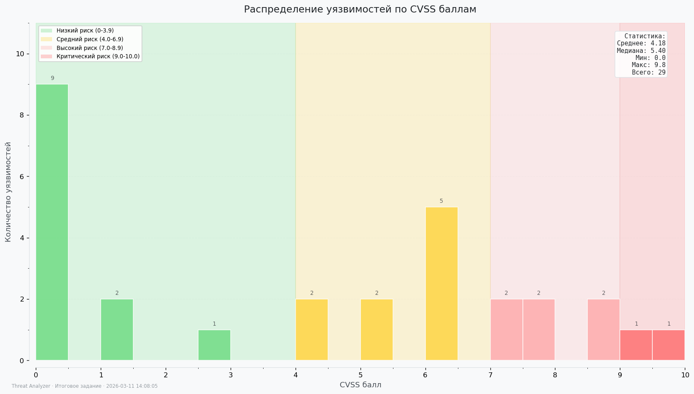

# Threat Analyzer


Автоматизированный анализ угроз на основе сетевых логов и данных об уязвимостях.

Учебный проект на Python, который демонстрирует базовый процесс **Threat Intelligence и реагирования на инциденты**:

* сбор данных из нескольких источников
* анализ потенциальных угроз
* имитация реагирования
* формирование отчётов
* визуализация результатов

Проект разработан в рамках итогового задания по анализу информационной безопасности.

---

# Основные возможности

Скрипт выполняет следующие задачи:

1. Получает данные из **нескольких источников**

   * Vulners API (уязвимости CVE)
   * логи системы обнаружения вторжений **Suricata**

2. Анализирует данные

   * ищет **уязвимости с высоким CVSS**
   * выявляет **подозрительные IP-адреса**

3. Реагирует на угрозы

   * выводит предупреждение
   * имитирует блокировку IP

4. Формирует отчёты

   * CSV
   * JSON

5. Создаёт визуализацию

   * распределение CVSS
   * топ IP

---

# Используемые технологии

* Python 3.8+
* requests
* pandas
* matplotlib
* pytest
* python-dotenv

---

# Источники данных

Проект использует **два источника данных**:

### 1. Vulners API

Используется для получения информации об уязвимостях:

* CVE
* CVSS score
* описание уязвимости

https://vulners.com

---

### 2. Логи Suricata

Используются события IDS/IPS.

Программа умеет читать **два формата логов**:

1. **JSON**

```
alerts-only.json
```

2. **JSON Lines (EVE format)**

```
suricata_sample.json
```

---

# Структура проекта

```
threat-analyzer/
│
├── analyzer.py
├── api_client.py
├── config.py
├── log_parser.py
├── main.py
├── reporter.py
├── responder.py
├── visualizer.py
├── email_sender.py
│
├── threat_analyzer.log           # Лог файл (создаётся при запуске)
├── blocked_ips.log               # Лог заблокированных IP (создаётся при запуске)
│
├── requirements.txt
├── README.md
│
├── .gitignore
├── .env                          # Файл с переменными окружения (API ключ)
│
├── logs/                        # Папка для логов Suricata
│   ├── alerts-only.json
│   └── suricata_sample.json
│
├── reports/                     # Папка для отчётов (создаётся автоматически)
│   ├── critical_cves.csv
│   ├── cvss_distribution.png
│   ├── summary.json
│   ├── threat_analysis.png
│   └── top_ips.csv
│
└── tests/
    ├── test_analyzer.py
    ├── test_api_client.py
    ├── test_log_parser.py
    ├── test_reporter.py
    ├── test_responder.py
    ├── test_main.py
    ├── test_config.py
    └── test_visualizer.py
```

---

# Описание модулей

### main.py

Главная точка входа приложения.

Выполняет:

* загрузку логов
* запрос к Vulners API
* анализ данных
* реагирование
* создание отчётов и графиков

---

### log_parser.py

Парсит логи Suricata.

Поддерживает:

* JSON
* JSON Lines (EVE format)

---

### api_client.py

Клиент для работы с **Vulners API**.

Получает:

* список CVE
* CVSS score

---

### analyzer.py

Анализирует данные:

* выделяет **критические уязвимости**
* определяет **топ IP-адресов**
* рассчитывает статистику CVSS

---

### responder.py

Модуль реагирования.

При обнаружении угроз:

* выводит предупреждение
* имитирует блокировку IP

---

### reporter.py

Формирует отчёты:

* CSV
* JSON

---

### visualizer.py

Создаёт визуализации:

* распределение CVSS
* топ IP

Если запустить модуль **отдельно**, он дополнительно создаёт **2 тестовых PNG-графика**.

---

# Установка

### 1. Клонировать репозиторий

```bash
git clone https://github.com/username/threat-analyzer.git
cd threat-analyzer
```

---

### 2. Создать виртуальное окружение

Linux / macOS

```bash
python -m venv venv
source venv/bin/activate
```

Windows

```bash
python -m venv venv
venv\Scripts\activate
```

---

### 3. Установить зависимости

```bash
pip install -r requirements.txt
```

---

# Настройка API

Получите API ключ Vulners:

https://vulners.com

Добавьте ключ в файл `.env` в корне проекта:

```
VULNERS_API_KEY=ваш_api_ключ
```

---

# Подготовка логов

Поместите логи Suricata в папку:

```
logs/
```

Или используйте существующие:

```
alerts-only.json
suricata_sample.json
```

---

# Запуск приложения

```bash
python main.py
```

Запуск с параметрами
```bash
python main.py --log-file logs/custom.json --vuln-limit 50 --threshold 8.0
```


После выполнения будут созданы отчёты в папке:

```
reports/
```

---

# Генерируемые отчёты

| Файл                  | Описание                       |
| --------------------- | ------------------------------ |
| critical_cves.csv     | список критических уязвимостей |
| top_ips.csv           | топ IP по количеству событий   |
| summary.json          | краткая статистика             |
| cvss_distribution.png | распределение CVSS             |
| threat_analysis.png   | топ IP в виде графика          |

---

# Визуализация отдельно

Можно отдельно протестировать визуализацию:

```bash
python visualizer.py
```

Это создаст **дополнительные тестовые графики PNG**.

## Пример визуализации



---

# Запуск тестов

Проект использует **pytest**.

Запуск всех тестов:

```bash
pytest tests/ -v
```

Запуск конкретного теста:

```bash
pytest tests/test_api_client.py -v
```

---

# Пример работы

После запуска скрипта:

1. Загружаются логи Suricata
2. Выполняется запрос к Vulners API
3. Анализируются CVE и сетевые события
4. Выявляются угрозы
5. Имитируется реагирование
6. Формируются отчёты и графики

---

# Пример вывода

```
=== КРИТИЧЕСКИЕ УЯЗВИМОСТИ (CVSS >= 7.0) ===
CVE-2026-3826 | CVSS: 9.8 | IFTOP developed by WellChoose has a Local File Inclusion vulnerability, allowing unauthenticated rem...
...

Всего критических уязвимостей: 8
Средний CVSS: 8.23
Максимальный CVSS: 9.8
=============================================

[2026-03-11 14:08:03] SIMULATED BLOCK: IP 192.168.1.10 blocked. Reason: Более 3 событий

============================================================
ИТОГОВАЯ СВОДКА АНАЛИЗА УГРОЗ
============================================================

Источники данных:
  • Уязвимости: 29
  • Alert-события: 9

Результаты анализа:
  • Критические CVE: 8
  • Уникальных IP в логах: 5

Реагирование:
  • Заблокировано IP: 1
  • Список: 192.168.1.10

Сохранённые файлы:
  • cve: reports\critical_cves.csv
  • ip: reports\top_ips.csv
  • summary: reports\summary.json

📈 Графики:
  • ips: reports\threat_analysis.png
  • cvss: reports\cvss_distribution.png

============================================================
✅ Анализ успешно завершён!
============================================================
```

## Email-уведомления (опционально)

Проект поддерживает отправку **email-уведомлений при обнаружении угроз**.

Если обнаружены:

* критические CVE
* подозрительные IP

скрипт может отправить уведомление на указанный email.

Для этого используется модуль:

```
email_sender.py
```

### Настройка

Добавьте в файл `.env`:

```env
EMAIL_ENABLED=true
SMTP_SERVER=smtp.gmail.com
SMTP_PORT=587
SENDER_EMAIL=your_email@gmail.com
SENDER_PASSWORD=your_app_password
RECIPIENT_EMAIL=recipient@gmail.com
```

### Важно

Для Gmail необходимо использовать **пароль приложения**, а не обычный пароль.

Инструкция:
https://support.google.com/accounts/answer/185833

### Пример уведомления

```
КРИТИЧЕСКИЕ УГРОЗЫ ОБНАРУЖЕНЫ!

📊 Статистика:
- Критических CVE: 8
- Подозрительных IP: 1

🕐 Время: 2026-03-11 14:08:03

📁 Отчёты сохранены в папке reports/
```

Если email-уведомления отключены (`EMAIL_ENABLED=false`), скрипт продолжит работу без отправки сообщений.


---

# Цель проекта

Проект демонстрирует базовый workflow аналитика безопасности:

* сбор данных
* корреляция событий
* выявление угроз
* реагирование
* отчётность
* визуализация

---

# Лицензия

Учебный проект.


